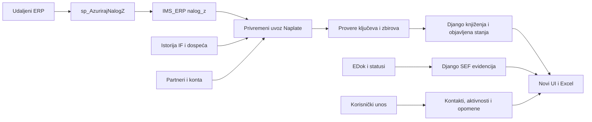

# Nova Naplata: Django tabele, sinhronizacija i UI

Datum pregleda: **18.09.2026.** Plan je dopunjen prvom implementacionom fazom:
formiran je modul `potrazivanja` sa 19 Django modela i migracijama. Stanje ove faze
opisano je u odeljku 11; ostale funkcionalnosti su plan narednih isporuka.

## 1. Odluka i granice prve isporuke

Napraviti novu implementaciju Naplate sa Django-managed tabelama, lokalnim obračunima i
sinhronizacijom. Razvijati je paralelno sa postojećom Naplatom, u zasebnom modulu
`potrazivanja` i privremenoj ruti `/potrazivanja/`, uz korisnički naziv „Naplata — novi pregled“.
Modul `potrazivanja` sada postoji; privremena ruta i novi UI još nisu uvedeni. Tek nakon usaglašavanja rezultata preusmeriti
postojeće ulaze. Ne menjati `managed=False` u `True` na starim modelima kao zamenu za migraciju.

Nove tabele kreirati Django migracijama na `default`; u pregledanom okruženju `default` i
`server_db` pokazuju na isti server i bazu. Postojeći SQL objekti ostaju izvori i osnova
za poređenje. Odvojiti migracije strukture od ponovljivih komandi za prenos podataka.

Planirana funkcionalna celina pokriva dugovanja, starosne razrede, partnere, šifre posla i centre, kontakte,
napomene, pozive, pisma, opomene, evidenciju tužbi, spisak za proveru i neodobrene IF.
Pravna služba već ima Django modele: povezati i uskladiti njen UI, uz očuvanje postojećih
postupaka i istorije, umesto ponovnog unosa istih predmeta.

Potvrđeno sa korisnikom tokom pregleda:

- **Ispravke posle 30. aprila namerno koriste prethodnu godinu.** To nije greška koju treba
  „popraviti“ na tekuću godinu.
- **„Veliki“ označava velikog/važnog kupca**, a ne važnost pojedinačne napomene. U novoj
  strukturi to je osobina profila kupca.

## 2. Šta aplikacija sada koristi

Pregledani su modeli, URL-ovi, upiti, obrasci, import opomena, pravna služba, šabloni, prava
pristupa, veze drugih modula i definicije svih osam finansijskih view-ova u živoj bazi.
Ranija SQL skripta `sql/naplata_views_ims_erp.sql` nije potpuno jednaka stvarnim definicijama;
za realizaciju koristiti snimljene definicije iz baze i potvrđena pravila.

| View | Stvarna uloga i zavisnosti | Buduća zamena |
|---|---|---|
| `partneri` | Udaljeni BazaIMS.partner + Gruppartner; sve grupe, ne samo grupa 1 | Sinhronizovan finansijski identitet partnera i veza ka postojećem registru |
| `baza` | Udaljeni nalog_z, partneri; firma 1, grupa 1, konta 20400%/20500%; godišnji izbor i POC | Lokalna knjiženja i servis obuhvata |
| `v_if` | IF od 2025. iz udaljenog nalog_z + UNION ALL tabela_if; izvor dospeća | Evidencija izvornih dokumenata i istorijskih dospeća |
| `v_duplikati` | IF iz svih godina + duplikati18; partner/veza u više godina i MAX dospeća | Resolver dospeća sa dokazom porekla |
| `dodela_baketa` | baza + prethodna dva view-a; saldo, dospeće, starost i domaće/ino | Lokalna projekcija otvorenih stavki i starosni razredi |
| `ispravke` | Udaljeni nalog_z + konto + partneri; konta 2049%, 2059%, 2048%, 2058% | Lokalna knjiženja, sa posebnim pravilom prethodne godine |
| `v_tuzeni` | Udaljeni nalog_z + konto + partneri; 2048%/2058%, promena='O' | Lokalni računovodstveni pregled utuženih potraživanja |
| `v_neodobreneIF` | EFaktura.EDok + EStatusIZ + BazaIMS.partner | Sinhronizovani elektronski dokumenti/statusi |

`v_neodobreneIF` filtrira datum dokumenta od 2025, `sif_dok=50`, `StatusIz=20` i status
različit od Approved. To je podskup poslatih faktura, ne kompletna istorija SEF statusa.
Izvorni `EDok` ima pravi primarni ključ **ID**; sačuvati ga. Izvedeni prikaz broja fakture
`SUBSTRING(EID,5,20)` nije pouzdan identifikator za sinhronizaciju.

Postojeći detalj partnera pri otvaranju radi deset SQL upita, uz šest ORM kolekcija operativnih
evidencija. Više puta prolazi isti lanac view-ova radi baketa i spiskova faktura. Stranice
pretežno povlače ceo rezultat pa tek onda koriste tabelu u pregledaču. Pravna služba već ima
hero elemente, ali ostatak Naplate nema jedinstven osnovni šablon i servis podataka.

## 3. Obim podataka i nalazi kvaliteta

Brojevi su snimak tokom pregleda, ne trajne konstante; veličine tabela očitane su iz SQL
metapodataka, a navedene kontrole kvaliteta zasebnim agregatnim upitima.

| Evidencija | Broj redova | Prenos |
|---|---:|---|
| Lokalni nalog_z | 731.627 | Knjiženja 2019–2026; u Naplatu preuzimati potreban obuhvat |
| tabela_if | 98.791 | Istorija 2006–2024, obavezno sačuvati |
| duplikati18 | 111.153 | Istorija 2006–2020, obavezno sačuvati |
| Kontakti | 654 | Prenos u povezanu evidenciju kontakata |
| Napomene | 103 | Tekst napomene + izdvajanje oznake važnog kupca |
| Opomene | 895 | Dokumenti sa stavkama i sačuvanim originalnim tekstom faktura |
| Pozivna pisma | 133 | Dokumenti iste porodice kao opomene |
| Telefonski pozivi | 2.474 | Aktivnosti naplate |
| Stara evidencija tužbi | 32 | Očuvati kao izvorne evidencije, povezivati provereno |
| Spisak za proveru (`avans_klijent`) | 7 | Oznaka profila kupca, nije automatski knjigovodstveni avans |
| Pravni postupci | 127 | Zadržati postojeće Django zapise i identitete |
| Promene postupaka | 379 | Zadržati veze i celu istoriju |
| Pravila baketa / kategorije | 7 / 2 | Uređeni šifarnici sa celobrojnim granicama |

Važni nalazi:

1. `partneri` ima 13.607 redova i 13.588 različitih `sif_par`. Sama šifra nije globalni ključ.
   Provera kombinacije firma/grupa/šifra nije našla duplikate; nema ih ni za šifru unutar
   firme 1 i grupe 1. Nove veze moraju čuvati puni finansijski identitet.
2. `ugovori.Partner` već sadrži 13.406 partnera. U pregledanim podacima nema dupliranog
   nepraznog `external_sif_par`, ali polje nije jedinstveno ograničeno i ne sadrži firmu/grupu.
   Postojeći import bira jednu grupu po šifri. Zato ga ne povezivati slepo samo po broju.
3. Pod pretpostavkom firme 1/grupe 1, 32 kontakta, 13 napomena i 16 opomena nemaju odgovarajućeg
   partnera. Među njima 32 kontakta, 13 napomena i 3 opomene imaju NULL ili necelobrojnu šifru.
   Sačuvati sve takve zapise za ručno povezivanje; ne odbacivati i ne vezivati po sličnom nazivu.
4. U tabela_if postoje 7.424 reda bez dospeća, a u duplikati18 njih 6.105. To nisu automatski
   brojevi današnjih otvorenih faktura bez dospeća, već kvalitet pomoćne istorije.
5. U nalog_z nisu pronađeni dupli ključevi firma/godina/vrsta/broj/stavka. Pregled metapodataka
   nije pokazao indekse na nalog_z i dvema istorijskim tabelama. Plan indeksa proveriti pre
   masovnog uvoza i prebacivanja; ne pretpostaviti da aplikacioni unique constraint ubrzava izvor.
6. Stare operativne tabele koriste i `float` za šifre i iznose; fakture u opomenama su tekst.
   Novi iznosi koriste Decimal, a veze FK. Sačuvati originalnu vrednost i kontrolisati zaokruživanje.
7. `tabela_if.saldo` je SQL numeric(38,2). Izmereni najveći apsolutni iznos staje u decimal(18,2),
   ali uvoz ipak mora proveravati opseg, umesto prećutnog sužavanja tipa.

## 4. Predložene Django evidencije

Tabela opisuje ciljnu strukturu. Početni modeli su formirani; razlike i obuhvat prve faze
navedeni su u odeljku 11.

| Model / evidencija | Sadržaj i veze |
|---|---|
| `FinancePartnerIdentity` | Jedinstveni `(source_system, company, partner_group, partner_code)`, izvorni naziv/podaci, opcioni FK na `ugovori.Partner`, stanje mapiranja i izvor sinhronizacije |
| `CollectionProfile` | Jedan profil po finansijskom identitetu: važan kupac, spisak za proveru, odgovorna osoba; Django vlasnik ovih podataka |
| `ReceivablePosting` | Jedna izvorna stavka, jedinstveni izvor/firma/godina/vrsta/broj/stavka; partner, konto, OJ, šifra posla, datum dokumenta/knjiženja/dospeća, duguje/potražuje, izvorni hash i aktivnost |
| `InvoiceDocument` | Izvorno identifikovan dokument, partner, godina i broj, datumi; stabilan ID koji ne zavisi od prikaznog broja ili trenutnog salda |
| `DueDateEvidence` | Dospeća iz IF, tabela_if i duplikati18 sa godinom, partnerom, vezom, izvornim vrednostima i poreklom; istorijska pomoćna evidencija, ne još jedno knjiženje prihoda |
| `ReceivablePosition` | Izvedeno stanje po partneru, vezi dokumenta, šifri posla i porodici konta; duguje, potražuje, saldo, razrešeno dospeće i dokaz izbora; veza na objavljenu verziju obračuna |
| `CollectionContact` | FK na finansijski identitet/profil, ime, kanal/adresa kontakta, napomena, aktivnost i autor; stari nerazrešeni kontakti ostaju sa oznakom potrebe za povezivanjem |
| `CollectionActivity` | Beleška ili telefonski kontakt: partner, datum događaja, sadržaj, autor, ishod; po potrebi budući rok za sledeću radnju |
| `CollectionNotice` + `CollectionNoticeItem` | Opomena/pozivno pismo i njene stavke: partner, broj, godina, datum, iznos/valuta, vezani dokument, iznos u trenutku izdavanja; originalni tekst faktura se čuva |
| `ElectronicInvoiceStatus` | Izvorni EDok.ID/EID, firma, partner, OJ, godina, datumi, status i vreme statusa; posebna sinhronizacija jer nalog_z nije izvor SEF statusa |
| `AgingRule` | Šifra, opis, granice dana, redosled i predložena aktivnost; bez float oznake 0.1 kao primarnog ključa |
| `CollectionSyncRun`, koraci i `ImportIssue` | Obuhvat, status, izvori/verzije, kontrolni zbirovi, trajanje, greške, problemi mapiranja i bezbedno objavljivanje |
| `LegacyImportMap` | Jedinstvena veza izvorna tabela/stari ID → novi zapis; osnova ponovljivog prenosa i kontrole da ništa nije izgubljeno |

Postojeći `Postupak` i `PromenaPostupka` ostaju evidencija pravne službe. Dodavanje veze na
finansijski identitet i dokumente radi se postepeno, nullable FK-om, uz očuvanje postojećeg
naziva/šifre kao istorijskih vrednosti. Stare `tuzbe`, knjigovodstveni `v_tuzeni` i pravni
`Postupak` nisu tri kopije istog entiteta i ne smeju se automatski spojiti po partneru.

Finansijski identitet nije novi konkurentski registar poslovnih partnera: čuva izvorni ključ
i mapira ga na postojeći `ugovori.Partner`. Ne prepisuje APR-proverene ili ručno održavane
podatke tog registra. Podudaranje po PIB/MB je kandidat za proveru, ne automatski dokaz.

Pravila projektovanja:

- Stabilni Django PK i unique constraints za proverene izvorne ključeve; ne koristiti naziv
  partnera, redni broj iz rezultata view-a ili hash promenljivog iznosa kao identitet.
- Izvorna finansijska polja menja sinhronizacija; kontakte, aktivnosti, oznake i opomene menja
  korisnik. Ponovni uvoz ne sme izbrisati korisnički rad.
- Decimal iznosi u RSD; devizni iznos i valuta zasebno. Ne sabirati devizne iznose različitih
  valuta. Konto domaće/ino iz starog izveštaja nije isto što i valuta knjiženja.
- Dokument može biti ponovljenog broja u različitim godinama. POC/uplata sa `vez_dok` nije
  automatski dokument godine knjiženja. Nejasne veze ostaju nerazrešene, bez izmišljene raspodele.
- Istorijske tabele nemaju PK: preneti ih u nepromenljivu uvoznu seriju, uz hash sadržaja i
  broj ponavljanja istog reda. Ponovljen uvoz iste serije ne dodaje duplikate; ne brisati
  identične izvorne redove bez utvrđivanja da li imaju poslovno značenje.
- OJ i šifra posla se čuvaju kao izvorne vrednosti, uz buduće opcione veze na centralni
  organizacioni registar. Ovaj posao ne zavisi od završetka reorganizacije i ne parsira centar
  iz prefiksa šifre. Za sada koristiti postojeće provereno mapiranje centra.
- Za reference na finansijske zapise koristiti zaštitu od fizičkog brisanja; promene i
  arhiviranje operativnih evidencija beležiti sa autorom i vremenom.

## 5. Obračuni koji moraju biti eksplicitni

Saldo je **zbir duguje − zbir potražuje** nad izabranim knjiženjima. U postojećem prikazu
`potražuje` nije dokazana zasebna evidencija bankarskih uplata: može sadržati i preknjiženja
ili druga zatvaranja. Bez potvrđenih vrsta knjiženja i povezivanja ne zvati taj zbir „naplaćeno“.

Početnu kompatibilnu projekciju računati kao postojeći dodela_baketa: partner + veza dokumenta
+ šifra posla + porodica konta, uz eksplicitnu firmu/grupu u novom modelu. Naziv partnera nije
identitet. Sačuvati i negativne salde; oni se ne smeju pretvoriti u nulu ili ukloniti kao greška.
Nulti saldo može nestati sa liste otvorenih stavki, ali njegovi dokumenti i aktivnosti ostaju.

Dospeće: postojeći algoritam za partnera/vezu koja postoji u više godina bira MAX dospeća;
za ostale bira MIN iz v_if. Sačuvati trag koji izvor je doveo do datuma. Zbog nedostatka
firme/grupe u staroj istoriji potrebna je provera pripadnosti; ne množiti nasleđene podatke
na više partnera koji slučajno imaju istu šifru.

Starosni razredi su: nedospelo (dospeće na dan analize ili u budućnosti), 1–30, 31–45, 46–60, 61–90,
91–180 i preko 180 dana kašnjenja. Danas bez dospeća CASE daje baket 0.1, a drugi CASE
kategoriju 1; to je nesaglasnost. U novom UI predložena je zasebna oznaka „Bez podatka o
dospeću“, sa iznosom u ukupnom saldu. Promenu raspodele u sumarnim baketima potvrditi pre prelaska.

Godišnji obuhvat ostaje poseban za dugovanja, ispravke i utužene. Postojeći SQL koristi
`DATEADD(DAY,119, početak godine)` i poređenje sa GETDATE sa vremenom. To nije potpuno isto
što i uključivo kalendarski 30. april u svim godinama/satima. Korisnik je potvrdio prethodnu
godinu za ispravke; tačno ponašanje granice i prestupne godine posebno usaglasiti i testirati.

UI jasno razlikuje **datum stanja salda**, **datum računanja starosti** i **vreme preuzimanja**.
Starost računati lokalno za datum analize, da sutrašnje kašnjenje ne zavisi od osvežavanja
iznosa u 10 h. Istorijsko stanje na izabrani dan zahteva knjiženja/početno stanje tog obuhvata;
zamena GETDATE datumom ne vraća sama istorijski saldo. Snimci čuvaju stanje od početka njihovog
vođenja; prethodno poznato stanje nije moguće rekonstruisati iz jednog današnjeg snimka.

## 6. Sinhronizacija

Predloženi tok nakon realizacije i provere obuhvata lokalnog izvora:

1. Jedna servisna funkcija i Celery omotač, kao kod postojećeg osvežavanja nalog_z. Ručni
   zahtev poziva istu funkciju; GET ne pokreće preuzimanje. SQL lock protiv preklapanja.
2. Iskoristiti postojeći raspored 10:00/11:00 kao jedan koordinisan tok: prvo procedura,
   zatim nova Naplata. Ne zakazivati dva nezavisna zadatka u isti minut i pretpostaviti redosled.
   Uvesti koordinaciju tek kada nova sinhronizacija bude spremna. Zauzet/neuspešan izvor nije
   uspešan preduslov za nastavak nad navodno svežim podacima.
3. Preuzimati lokalna knjiženja potrebnih konta za dugovanja/ispravke/utužene; dokaze dospeća
   izdvojeno iz svih potrebnih IF stavki i istorije. Ne sužavati dospeća automatski na ista
   dva konta kao saldo, jer postojeći v_if/v_duplikati ne koriste taj filter.
4. Procedura trenutno posle aprila osvežava samo tekuću godinu. Nova Naplata za ispravke
   tada traži prethodnu! Definisati odvojeno provereno osvežavanje prethodne godine ili
   proširenje procedure sa vlasnikom baze; postojeća stara kopija nije dokaz svežine.
5. Procedura ne propagira brisanja iz izvora. Samo čitanje lokalnog nalog_z ne može utvrditi
   da li je red udaljeno obrisan. Pre prelaska utvrditi tombstone/kompletno poređenje ili
   odgovarajuće proširenje izvornog osvežavanja. Postojeća procedura se ovim planom ne menja.
6. Bez pouzdanog datuma izmene ne koristiti samo MAX(id) ili nove brojeve naloga. Uvoz po
   kompletnom potvrđenom obuhvatu + hash sadržaja + ažuriranje postojećih ključeva. Nestali red
   označiti neaktivnim samo iz potvrđeno kompletnog autoritativnog obuhvata.
7. Pre objave proveriti broj redova, ključ, zbir D/P/salda po godini, kontu, partneru i šifri,
   pokrivenost istorijom, nerazrešene veze i NULL vrednosti. Objaviti celu novu verziju jednom
   transakcijom/promenom aktivne serije. Neuspeh zadržava poslednje kompletno stanje.
8. SEF osvežavati posebno po EDok.ID. Faktura koja nestane iz view-a neodobrenih može biti
   odobrena, obrisana ili van filtera; odsustvo ne znači samo po sebi status Approved.
   Za već praćene ID-jeve čitati stvarni status iz EDok; istorija počinje od trenutka praćenja.
9. Partneri/konta imaju zaseban korak preuzimanja i svoju evidenciju svežine. Nedostajući
   korak ne sme prećutno proizvesti „nema duga“. Prikazivati ishod svakog skupa podataka.

Lokalni nalog_z je izvor, a `ReceivablePosting` je upravljana projekcija podataka za Naplatu,
ne još jedan servis koji piše u nalog_z. `finansije.LedgerEntry` ostaje postojeći finansijski
skup u ovoj fazi; ne menjati mu izvor ni pravila u istom koraku. Kasnije zajedničko preuzimanje
može zameniti dupliranje tek kada se usaglase obuhvati, istorija i odgovornosti.

Postojeći servis procedure i raspored su implementirani. U poslednjoj proveri broker nije
bio dostupan i lokalni worker/Beat nisu bili pokrenuti. To ostaje uslov operativnog zakazivanja,
uz worker koji poznaje novi koordinatorski zadatak. Ručno pokretanje ne zahteva broker.

## 7. UI usklađen sa aplikacijom

- Zajednički osnovni šablon sa hero prikazom; u pregledu ukupan saldo, dospelo/nedospelo,
  iznos bez dospeća, broj dužnika i raspodela po starosti/centrima. Sve oznake datuma eksplicitne.
- Lista dugovanja: 100 redova po strani, AJAX i serversko filtriranje/sortiranje; partner,
  centar, šifra posla, razred, domaće/ino, važan kupac i spisak za proveru u kartici filtera.
  Pretraga šifarnika preko servera kada skup opcija postane veliki.
- Detalj partnera: hero sa identitetom i iznosima, tabovi u kartici — otvorene stavke,
  knjiženja, dokumenti, kontakti, aktivnosti, opomene/pisma i pravni postupci. Ne ponavljati
  isto dugovanje u više gotovo jednakih tabela. Prve strane tabela preuzimati u pozadini
  sa ograničenim brojem paralelnih zahteva, bez čekanja klika na svaki tab.
- Opomene/pisma: dokument + izbor njegovih faktura/stavki, sa sačuvanim iznosom u trenutku
  izdavanja. Excel uvoz prvo validira i pokaže problematične redove; identitet uvoza sprečava
  ponovno dodavanje istog fajla. Slanje mejla nije automatska posledica kreiranja dokumenta.
- SEF, pravna služba i sinhronizacija imaju zasebne preglede u istom vizuelnom sistemu.
  Finansijski pregled utuženih i evidencija pravnih postupaka jasno se razlikuju.
- Datumi se sortiraju po sirovoj vrednosti, brojevi po Decimal/numeričkom ključu, uključujući
  minus. Svetlozelena i jasna crvena uz znak i tekst; informacija ne zavisi samo od boje.
- Excel koristi isti servis i iste filtere/dozvole kao tabela, uz zbir celog filtriranog
  skupa, ne samo prikazanih 100 redova.

## 8. Prava i veze sa ostalim aplikacijama

Stari detalj ograničava šifre zavisno i od `?report=1`; ne prenositi taj obrazac u novu aplikaciju.
Obuhvat određivati serverski iz korisničkih dozvola i centara u svakoj listi, detalju, AJAX
zahtevu i izvozu, nezavisno od ulaznog URL-a. Za deljenog partnera ograničen korisnik vidi samo
odobrene finansijske stavke; prava na kontakte i pravne podatke definisati odvojeno.

Pregledane veze koje zahtevaju kompatibilnost:

- Finansije: `finansije/services/job_tables.py` koristi `naplata.queries.izvestaj_po_siframa_posla_data`.
  Uvesti adapter sa istim povratnim ugovorom i istim obuhvatom prava dok ne pređe na novi servis.
- Menice: izbor partnera čita SQL `partneri`. View ostaje dok se taj modul posebno ne prebaci.
- Ugovori: import postojećeg registra čita isti view. Ne menjati ga globalno zbog Naplate.
- HR: evidencija aktivnosti korisnika uvozi `AvansKlijent`, `Postupak`, `PromenaPostupka`.
  Zadržati postojeće modele dok se potrošači ne prebace; za novi spisak za proveru dati adapter.
- Sidebar, dozvole, stari linkovi na partnera i Excel URL-ovi dobijaju mapiranje/rute za prelazak.
  Nije dovoljno samo zameniti naziv aplikacije u meniju.

## 9. Redosled realizacije i uslovi prelaska

1. **Struktura i pravila:** novi modul, Django modeli/migracije, mapiranje finansijskih
   identiteta, šifarnici baketa, import mape i problemi. Potvrditi preostale granice obračuna.
2. **Probni prenos:** stari ID-jevi i istorija, kontakti/aktivnosti/opomene, veze pravne službe.
   Komanda sa dry-run režimom, izveštajem i ponovljivošću; bez sečenja teksta i odbacivanja redova.
3. **Sinhronizacija i obračun:** lokalni izvor, istorija dospeća, kontrolni zbirovi, verzije
   objave, SEF izvor, zakazivanje i ručno pokretanje. Rešiti svežinu prethodne godine i brisanja.
4. **Novi UI samo za čitanje:** uporedni rad sa starim, iste filterske situacije i kontrole
   iznosa; posebno negativni saldi, isti brojevi faktura u više godina i nedostajuća dospeća.
5. **Operativni UI:** unos kontakata/aktivnosti/opomena i povezivanje pravne službe.
   Za vreme paralelne provere samo stara aplikacija prihvata poslovni unos. Pri prelasku
   kratko zaustaviti upis, ponoviti završni prenos i kontrole, zatim omogućiti novu kao jedinog pisca.
6. **Prelazak:** prebaci meni i adapter Finansija, obezbedi stare linkove; stara verzija ostaje
   za čitanje do potvrde. SQL view-ove ne brisati dok ih koriste Menice/Ugovori.

Povratak pre novih upisa je vraćanje ruta na staru aplikaciju. Posle upisa u novu aplikaciju
sam povratak menija nije dovoljan: potreban je pregled/prenos novih operativnih zapisa ili
privremeno čitanje bez unosa. Plan povratka mora pokriti i podatke, ne samo kod.

Kriterijumi prihvatanja: svi izvorni operativni redovi imaju import mapu ili sačuvan problem;
finansijski D/P/saldo su usaglašeni po svim dimenzijama za isti obuhvat; ponovljeni sync ne
duplira podatke; greška ne objavljuje polovinu rezultata; dospeća i baketi su objašnjivi;
istorija pravnih postupaka sačuvana; direktni URL/AJAX/Excel poštuju obuhvat; stranice ne
čitaju udaljene finansijske view-ove. Posebno testirati 29/30.04, 01.05, prestupnu godinu,
POC, NULL dospeće, godine pre 2025, korekcije i prestanak otvorenog salda.

## 10. Procena i otvorene odluke

Tehnički je izvodljivo i ima smisla zbog brzine, odnosa među podacima i održavanja. Obim je
srednje velik do velik: najveći posao je pouzdan prenos istorije i identiteta dokumenta,
uz očuvanje postojećih obračuna; sam hero i tabele su manji deo.

Otvoreno za realizaciju: kalendarska granica obračuna, tretman nepoznatog dospeća u sumama,
potvrda firme/grupe nasleđenih redova, način osvežavanja prethodne godine i izvornih brisanja,
pravila jednoznačnog vezivanja uplata/dokumenata i opseg istorijskih preseka. Potvrđene odluke
o ispravkama i važnom kupcu navedene su na početku i ne traže ponovnu potvrdu.

Prvobitni redosled faza ostaje plan razvoja. Stanje nakon aktiviranja paralelnog rada
18.09.2026. opisano je u odeljku 12 i u izveštaju stvarnog prenosa.

## 11. Formirana početna struktura

U aplikaciji `potrazivanja` definisano je 19 tabela sa sopstvenim prefiksom. Migracija
`0001_initial` kreira strukturu, indekse i ograničenja; `0002_initial_aging_rules` dodaje
sedam postojećih starosnih razreda. Podela modela:

| Oblast | Modeli |
|---|---|
| Partner i oznake | FinancePartnerIdentity, CollectionProfile |
| Dokumenti i knjiženja | InvoiceDocument, ReceivablePosting, DueDateEvidence |
| Stanja za prikaz | BalanceSnapshot, CollectionState, ReceivablePosition |
| Starosni razredi | AgingRule |
| Operativni rad | CollectionContact, CollectionActivity, CollectionNotice, CollectionNoticeItem |
| SEF i pravni postupci | ElectronicInvoiceStatus, LegalCaseLink |
| Prenos i provere | CollectionSyncRun, CollectionSyncStep, LegacyImportMap, ImportIssue |

Veze koriste postojeći registar `ugovori.Partner` i postojeći `naplata.Postupak`.
Važan kupac je polje profila, a ne napomene. Nepovezani stari zapisi mogu se sačuvati sa
originalnim podacima i izveštajem o problemu. Evidencija dospeća zadržava decimal(38,2)
za istorijski iznos; redovni finansijski iznosi koriste decimal(18,2).

U ovoj fazi SEF tabela čuva poslednji poznati status; posebna istorija promena statusa još
nije uvedena. Pravna služba dobija pomoćnu vezu na postojeći postupak, bez menjanja njegovih
polja. Ovaj opis se odnosi na početnu strukturu. Import, puna sinhronizacija, objavljivanje
i paralelni UI naknadno su uvedeni; pogledati odeljak 12. Stari ekrani nisu preusmereni.

Detalji ograničenja i načina budućeg upisa nalaze se u `potrazivanja/README.md`.

## 12. Aktiviran paralelni rad — 18.09.2026.

`/potrazivanja/` je dodat u meni pored Naplate. Primenjena je migracija `0003`, koja
dodaje `SourceDataset` i `SourceRow`: potpune nepromenljive verzije izvora, sa ponovnom
upotrebom identičnog sadržaja. Ukupno postoji 21 nova Django tabela.

Uvedeni su puna sinhronizacija svih dogovorenih view-ova i operativnih tabela, prenos
kontakata/napomena/poziva/opomena/pisama/starih tužbi, profili kupaca, zaštićene veze sa
postojećim pravnim postupcima i objavljivanje snimka tek posle kontrola. Brojčano poređenje
sa starom Naplatom sprovedeno je na stvarnim podacima. Nepovezani zapisi ostaju sačuvani.

UI ima pregled partnera po baketima, otvorene stavke po šiframa posla/centrima, knjiženja,
ispravke, neodobrene e-fakture, utužena potraživanja i operativne evidencije. Tabele su AJAX
sa 100 redova, a detalj partnera koristi tabove koji se učitavaju u pozadini.
Centar se preuzima iz izvornog `posao.blok`, po tačnoj šifri posla; ne izvodi se iz prefiksa.

Dugme poziva običnu funkciju `sync_collections`; ista funkcija ima Celery omotač. Novi
periodični raspored nije uključen. Postojeća procedura i njen raspored nisu menjani.
Sinhronizacija trenutno čita postojeće view-ove sa njihovim udaljenim zavisnostima, dok
svi novi ekrani koriste lokalne tabele. Izmene poslovne evidencije i dalje se unose u Naplati.

Nisu uvedeni: operativni unos u novoj aplikaciji, novi Excel izvozi, nezavisan novi obračun
dospeća, automatsko uparivanje uplata i faktura, kompletan SEF životni ciklus po EDok.ID,
preusmeravanje Finansija niti zamena SQL view-ova. Stari Word opisuje početni plan; aktuelni
status ove faze je u ovom odeljku i povezanom izveštaju.

Detalji: [tehnički opis](../potrazivanja/README.md) i
[rezultat stvarnog prenosa](potrazivanja-paralelni-prenos-2026-09-18.md).
